# 📚 Самостійна робота: Модуль "Дисципліни" (Варіант 7)

Цей модуль реалізує повний **CRUD-функціонал** (Create, Read, Update, Delete) для предметної області **"Дисципліни"**. 

1.  **Архітектура**:
    * Використано паттерн **Blueprint** (`disciplines_bp`) для повної ізоляції логіки.
    * Структура модуля: `models`, `views`, `forms`, `templates`, `static`.
    
2.  **Робота з даними (Models)**:
    * **Основна модель**: `Discipline` (назва, опис, кількість годин, зв'язок з автором).
    * **Допоміжна модель**: `DisciplineCategory` (категорія дисципліни: "Гуманітарна", "Технічна" тощо).
    * Реалізовано зв'язок **One-to-Many** між категоріями та дисциплінами.

3.  **Інтерфейс та UX**:
    * Використано **Bootstrap 5** для адаптивності.
    * **Кастомні стилі** (`disciplines.css`): ефекти наведення, тіні, градієнти.
    * Зручна навігація та модальні вікна для підтвердження видалення.

4.  **Функції**:
    * ✅ **Створення**: Додавання дисципліни з вибором категорії (SelectField).
    * ✅ **Перегляд**: Список усіх дисциплін з відображенням категорії та автора.
    * ✅ **Пошук**: Фільтрація записів за назвою.
    * ✅ **Редагування/Видалення**: Доступно **тільки власнику** запису (авторизація).

### 📷 Скріншоти
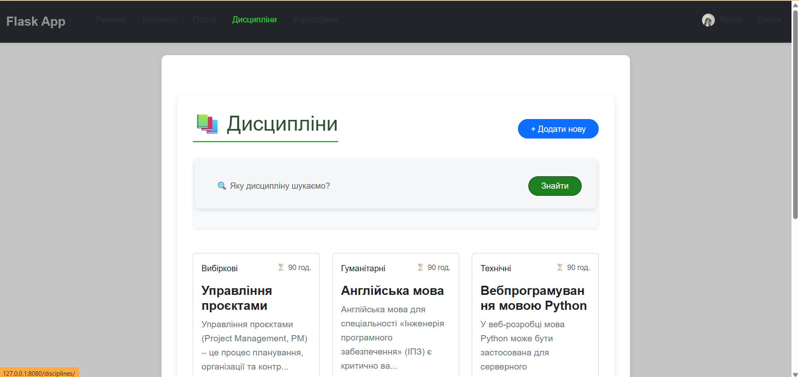
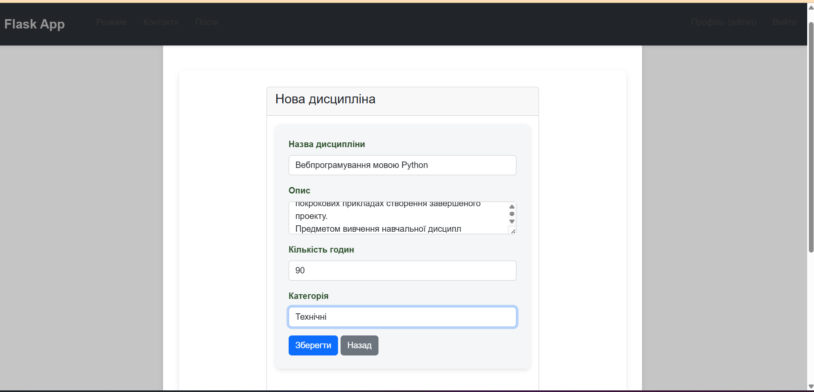
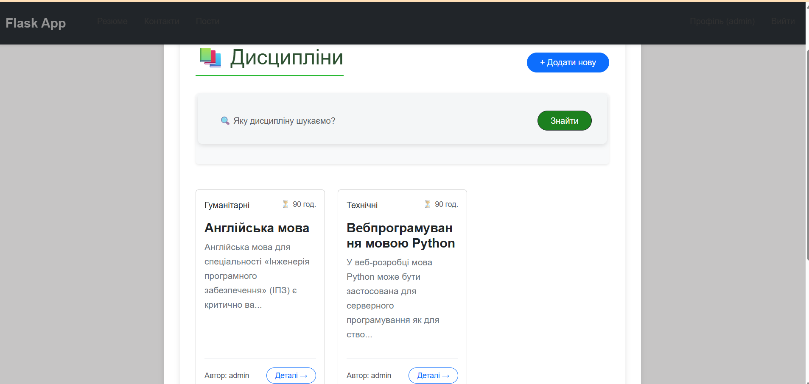
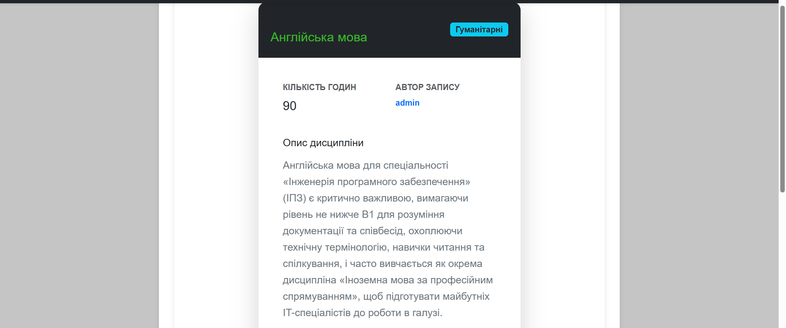
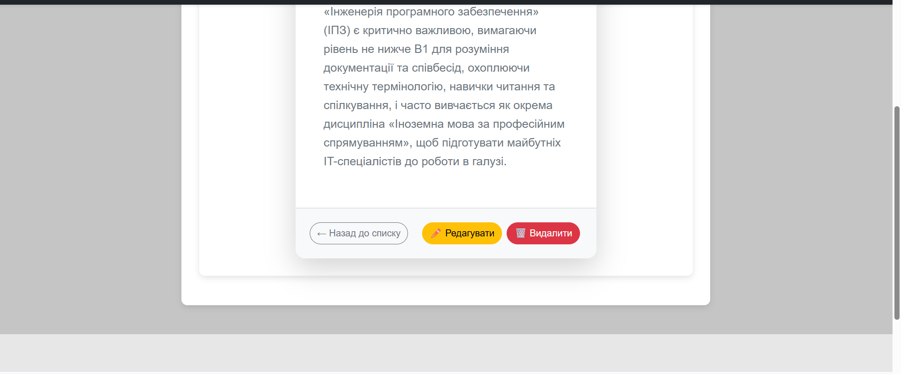
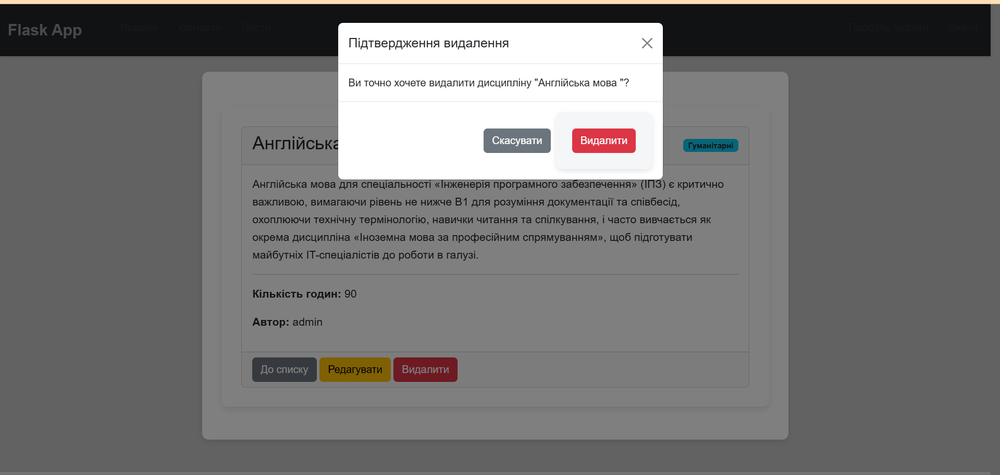
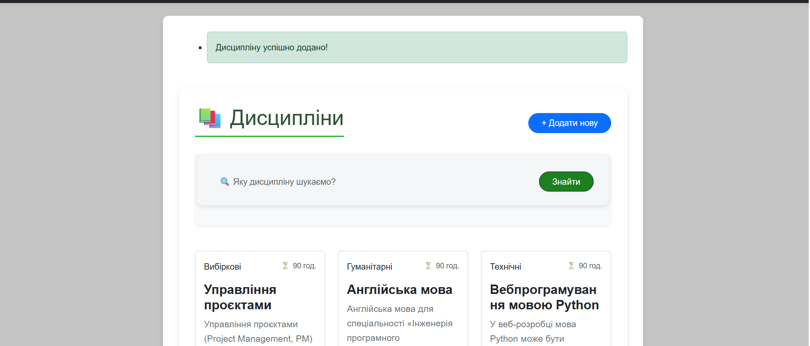
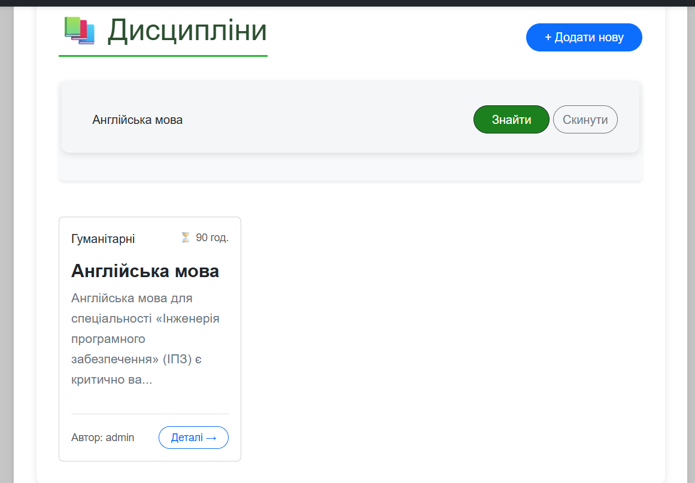
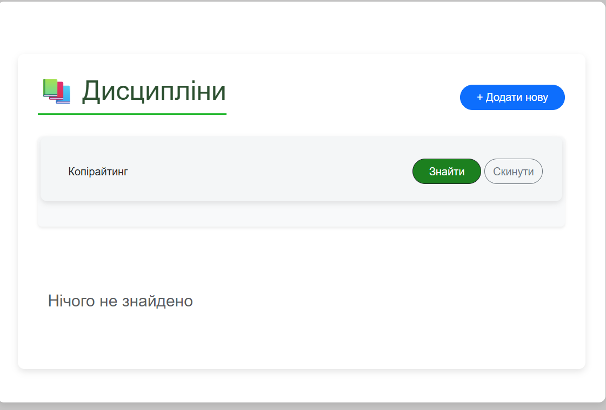
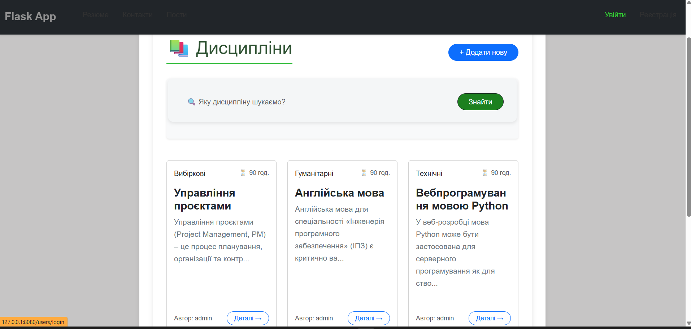
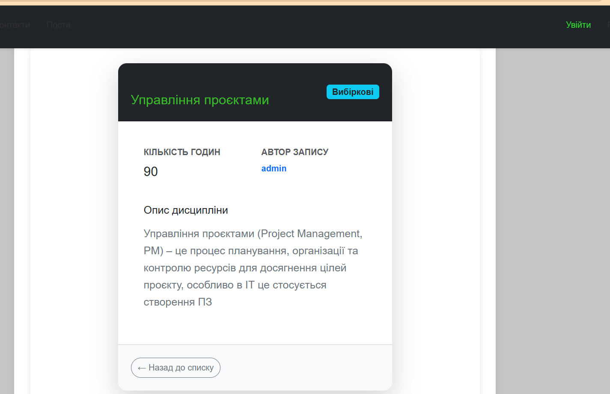
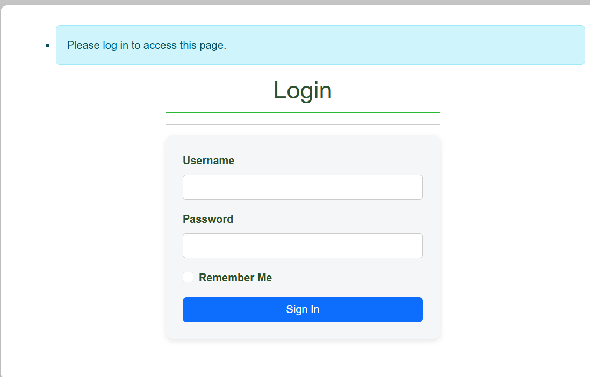
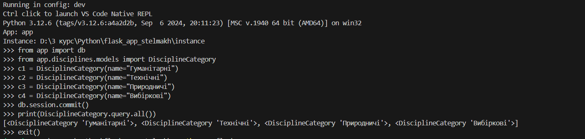
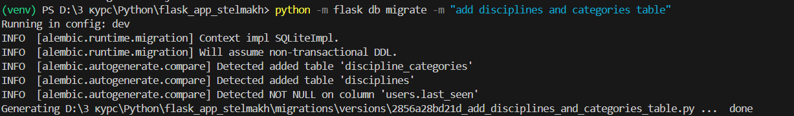