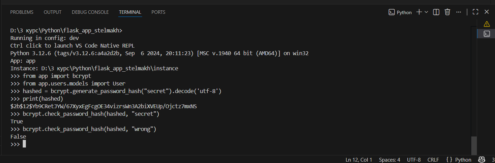
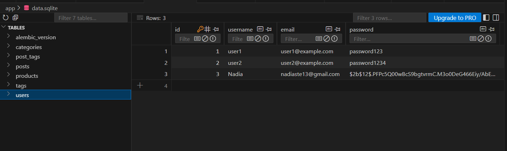
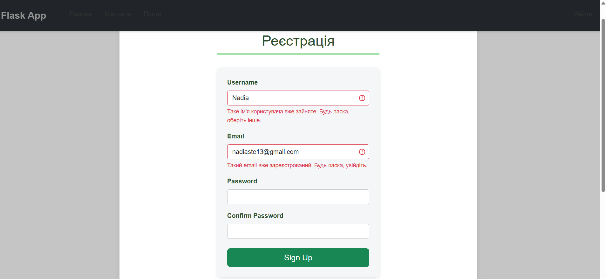
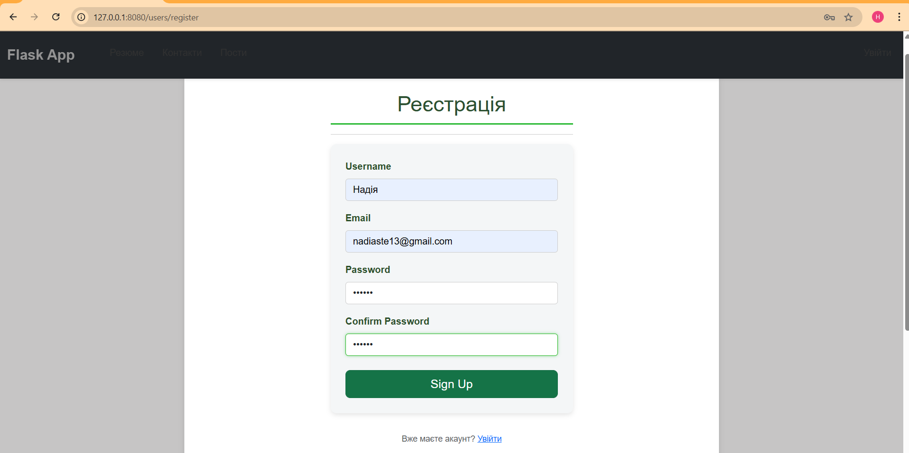
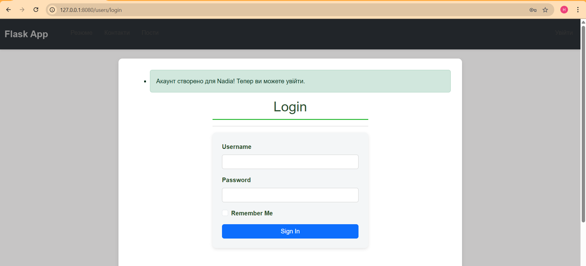
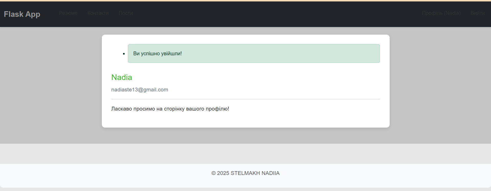
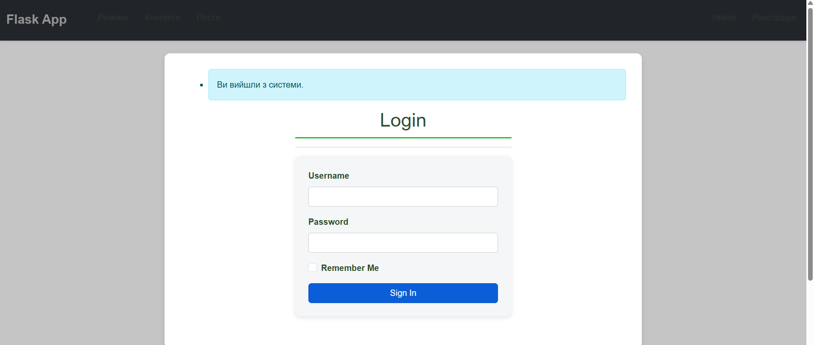
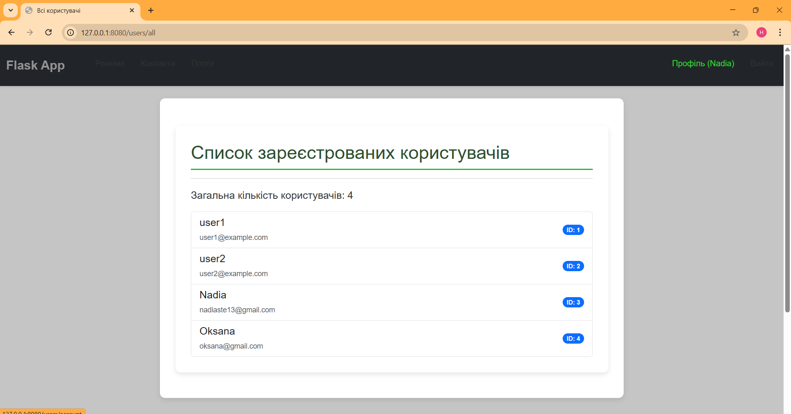
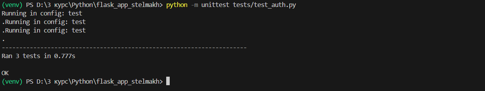

# Лабораторна робота №9: Побудова системи реєстрації та входу

### Перевірка хешування паролів

### Форма реєстрації з валідацією

### Успішна реєстрація

### Вхід та Профіль користувача

### Список користувачів
#### Доступна лише авторизованим користувачам, яка відображає список всіх зареєстрованих у системі.

### Тестування
#### Автоматичні тести (tests/test_auth.py) для перевірки реєстрації, входу, виходу та доступності сторінок.

